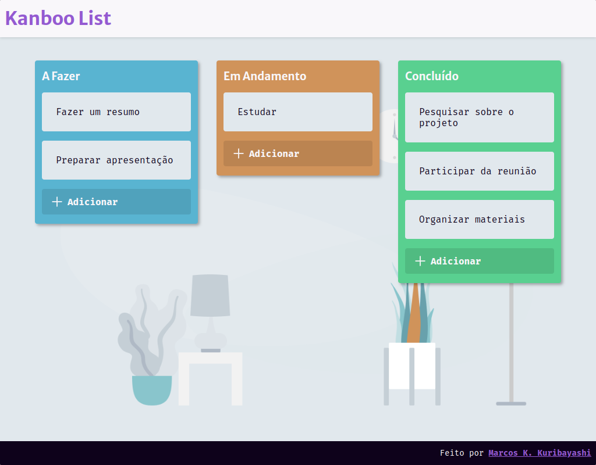
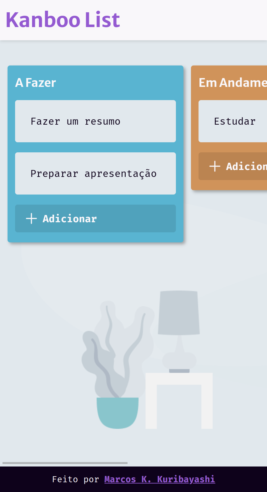
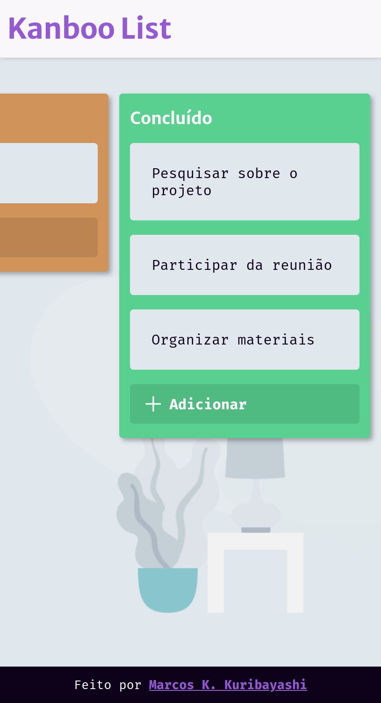

<!-- CABEÇALHO -->

    <h1 >
       📋 Kanboo List 📋
    </h1>
    

        <a href="#%EF%B8%8F-sobre-o-projeto">Sobre o Projeto</a> •
        <a href="#-funcionalidades">Funcionalidades</a> •
        <a href="#-layout">Layout</a> •
        <a href="#%EF%B8%8F-tecnologias">Tecnologias</a> •
        <a href="#-autor">Autor</a>
    

    

<!-- SOBRE O PROJETO -->

## 🖥️ Sobre o Projeto

 
  
  

Este é um pequeno projeto que consiste em uma aplicação front-end de um quadro Kanban.

O objetivo desse projeto foi praticar conceitos fundamentais de HTML, CSS, JavaScript e manipulação de DOM.

O Kanboo List oferece uma interface de usuário intuitiva para criar, atualizar e acompanhar tarefas em um quadro Kanban. O usuário pode arrastar e soltar as tarefas em qualquer uma das colunas do quadro para ter um melhor controle de suas responsabilidades. É uma ótima ferramenta para gerenciar projetos e atividades em geral de maneira eficiente.

<!-- FUNCIONALIDADES -->

## 💡 Funcionalidades

- [x] Criar tarefas
- [x] Mover tarefas para outras colunas de acordo com o seu status
- [x] Editar tarefas
- [x] Remover tarefas
- [x] Arrastar e soltar tarefas para a coluna que desejar

<!-- LAYOUT -->

## 🎨 Layout

  

  

  

O design do projeto foi baseado no seguinte [layout do Figma](<https://www.figma.com/file/2PCm79npUj1DUG82VpRb3I/Kanban-(Community)?node-id=25%3A2672&mode=dev>).

<!-- TECNOLOGIAS -->

## 🛠️ Tecnologias

Para o desenvolvimento desse projeto, as seguintes ferramentas foram utilizadas:

- **[HTML](https://developer.mozilla.org/pt-BR/docs/Web/HTML/)**
- **[CSS](https://developer.mozilla.org/pt-BR/docs/Web/CSS/)**
- **[JavaScript](https://developer.mozilla.org/pt-BR/docs/Web/JavaScript)**
- **[DOM](https://developer.mozilla.org/pt-BR/docs/Web/API/Document_Object_Model)**
- **[Git](https://git-scm.com/doc)**
- **[VS Code](https://code.visualstudio.com/)**

## 👨‍💻 Autor

Marcos Kenji Kuribayashi

 

---

Desenvolvido por Marcos Kenji Kuribayashi 😉
